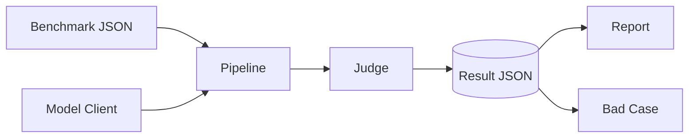

# llm-eval-harness

[](https://www.python.org/)
[](LICENSE)
[](https://github.com/Lixiang878/llm-eval-harness/actions/workflows/ci.yml)
[](https://github.com/astral-sh/ruff)
[](https://github.com/Lixiang878/llm-eval-harness)

> 一个轻量、可读、可复现的大模型评测框架：多模型对比、LLM-as-Judge 自动打分、Bad Case 归因。
> A lightweight, reproducible LLM evaluation harness: multi-model comparison, LLM-as-Judge scoring, and Bad Case attribution.

---

## 为什么做这个项目

大模型评测的工程难点不在于"算出一个数"，而在于三件事：**可比**（同一份评测集、同一把尺子）、**可复现**（同样的输入得到同样的判定）、**可归因**（低分到底低在哪里）。很多团队的做法是把脚本散落在 notebook 里，换一个模型就要重写一遍，分数还因人而异。

`llm-eval-harness` 把这条链路收敛成一个小工具：统一的评测集格式、可插拔的模型客户端、基于评分量表的自动裁判，以及对比报告与 Bad Case 归因。它**离线零依赖即可完整跑通**（内置 mock 模型与启发式裁判），也可以无缝接入真实模型与真实 LLM 裁判。代码量刻意控制得很小，每个模块都能单独讲清楚——这也是它适合作为工程能力佐证的原因。

## 特性

- **离线即可运行**：`MockClient` + `MockJudge` 不需要 API Key、不需要联网、不需要第三方包，开箱即跑。
- **真实模型适配**：`OpenAICompatibleClient` 兼容 OpenAI 及文心、通义、本地 vLLM 等 OpenAI 协议网关，仅在调用真实模型时惰性导入 `requests`。
- **LLM-as-Judge**：以评分量表（rubric）为基准，对准确性 / 完整性 / 相关性 / 可读性等维度自动打分；亦可改用真实 LLM 作为裁判。
- **可插拔评分量表**：维度与权重在 `configs/default_rubric.json` 自定义，裁判与报告自动识别新维度。
- **可扩展评测集**：评测集即 JSON，新增一条 `item` 即可扩充。
- **报告与归因**：`report` 生成多模型对比表（可选柱状图），`badcase` 自动按最弱维度归类低分样本。

## 架构



- **Model Client**（`src/llm_eval_harness/models/clients.py`）：定义 `BaseModelClient` 接口与 `complete(prompt) -> str`；`MockClient` 用于离线演示，`OpenAICompatibleClient` 用于真实模型。
- **Judge**（`src/llm_eval_harness/judge/`）：`rubric.py` 定义评分量表，`llm_judge.py` 实现打分逻辑（`MockJudge` 启发式 / `LLMJudge` 真实裁判）。
- **Pipeline**（`src/llm_eval_harness/pipeline.py`）：编排"逐条调用模型 → 逐条裁判 → 汇总"，产出结果 JSON。
- **Analysis**（`src/llm_eval_harness/analysis/`）：`report.py` 负责多模型对比与绘图，`badcase.py` 负责归因。

## 安装

```bash
git clone https://github.com/Lixiang878/llm-eval-harness.git
cd llm-eval-harness
pip install -e .          # 核心零依赖，仅需 Python 3.9+
```

可选能力通过 extras 安装：

```bash
pip install -e .[api]      # 接入真实模型 API（requests）
pip install -e .[chart]    # 生成对比柱状图（matplotlib）
pip install -e .[dev]      # 开发：pytest + ruff
```

安装后可直接使用控制台脚本 `llm-eval-harness`；不安装也可用
`python src/llm_eval_harness/cli.py ...` 运行（仓库根目录即工作目录）。

## 快速开始（离线演示）

```bash
# 1) 用强/弱两档 mock 模型跑评测，产出结果 JSON
llm-eval-harness run --model mock-strong --profile strong --out results/run_mock_strong.json
llm-eval-harness run --model mock-weak   --profile weak   --out results/run_mock_weak.json

# 2) 生成多模型对比报告（--chart 可选，输出柱状图 PNG）
llm-eval-harness report results/run_mock_strong.json results/run_mock_weak.json \
    --out results/report.md --chart results/compare.png

# 3) 对低分模型做 Bad Case 归因
llm-eval-harness badcase results/run_mock_weak.json --out results/badcase.md

# 4) 跑单元测试
pytest -q
```

一次真实离线运行的结果（`results/` 已随仓库附带）：

| 模型 | 样本数 | 总分(avg) | accuracy | completeness | relevance | format |
|---|---|---|---|---|---|---|
| mock-strong | 3 | 8.55 | 8.56 | 7.22 | 8.42 | 10.00 |
| mock-weak | 3 | 4.36 | 2.00 | 3.93 | 3.50 | 8.00 |

差距清晰，说明框架能区分模型质量，而不仅是一个"打分壳"。

## 接入真实模型

```bash
export OPENAI_API_KEY="sk-..."
llm-eval-harness run --model gpt-4o-mini \
    --benchmark configs/benchmarks/general_qa.json \
    --out results/run_gpt.json
```

对于文心 / 通义 / 本地部署等 OpenAI 兼容协议，在 `src/llm_eval_harness/cli.py` 的
`cmd_run` 中把 `spec` 改为：

```python
spec = {
    "type": "openai-compatible",
    "name": "qwen-max",
    "base_url": "https://dashscope.aliyuncs.com/compatible-mode/v1",
    "model": "qwen-max",
    "api_key": os.environ["DASHSCOPE_API_KEY"],
}
```

真实打分可把 `MockJudge` 换成 `LLMJudge(client)`，由另一个模型充当裁判。

## 相关作品对比

同类工具不少，定位各有侧重；本项目的取舍是"**小而透明、可归因**"：

| 项目 | 定位 | 规模 | 裁判方式 | 本项目的差异 |
|---|---|---|---|---|
| **lm-evaluation-harness**（EleutherAI） | 学术基准少样本评测框架 | 60+ 基准、生产级，HF Open LLM Leaderboard 后端 | 客观指标（精确匹配 / 困惑度等） | 它是"客观题"框架；本项目聚焦"主观开放题 + LLM-as-Judge + 归因" |
| **HELM**（斯坦福 CRFM） | 整体性、多指标评测 | 大而全、重透明度 | 多维度综合 | 它重"全"，本项目重"可读、可改、可嵌入" |
| **MT-Bench**（LMSYS） | 多轮开放问答能力 | 单基准、GPT-4 当裁判 | LLM 裁判 | 它是基准；本项目是可复用、可自定义 rubric 的脚手架 |
| **llm-eval-harness（本项）** | 轻量、可复现、可归因 | 小、每模块可讲清 | Rubric + 可选 LLM 裁判 + Bad Case 归因 | 离线零依赖、代码可读、归因内建 |

诚实地说：如果你要跑 MMLU / GSM8K 这类标准学术榜，直接用 lm-evaluation-harness；如果你要的是"给自己的私有评测集、用一把自定义尺子、快速看出哪个模型弱在哪"，这正是本项目存在的理由。

## 方法论（设计决策）

- **Rubric 即契约**：维度、量级、权重全部在 `default_rubric.json` 声明，报告与裁判都从它推导。换一把尺子只改一个文件，保证"可比、可复现"。
- **归因而非只打分**：`badcase` 按每条样本各维度得分与总均值的差距，定位"最弱维度"，把"低分"变成"可改的行动项"，而非一个数字。
- **Mock 是确定性回退**：`MockJudge` 用基于回答长度的启发式打分，仅为让整条链路在无 Key 时也能跑通与 CI；它**不替代**真实 LLM 裁判。
- **离线与真实同构**：真实路径与 mock 路径走同一套 Pipeline/Judge 接口，区别仅在客户端与裁判实现，便于对照验证。

## 配置

### 评测集（benchmarks）

JSON 文件，顶层为 `items` 数组，每条记录：

```json
{
  "id": "qa_001",
  "category": "科学常识",
  "prompt": "请简要解释什么是傅里叶变换？",
  "reference": "傅里叶变换将时域信号分解为不同频率的正弦分量……"
}
```

`reference` 供有参考答案的评测使用（裁判据此打分）；开放式评测可留空，裁判退化为
基于回答自身质量的启发式。

### 评分量表（rubric）

`configs/default_rubric.json` 定义维度与描述，例如：

```json
{
  "accuracy":    { "label": "准确性", "en": "Accuracy",    "scale": [0, 10], "description": "事实正确性" },
  "completeness":{ "label": "完整性", "en": "Completeness", "scale": [0, 10], "description": "要点覆盖度" },
  "relevance":   { "label": "相关性", "en": "Relevance",   "scale": [0, 10], "description": "是否切题" },
  "format":      { "label": "可读性", "en": "Readability",  "scale": [0, 10], "description": "表达与格式" }
}
```

新增维度只需加一个键，裁判与报告会自动纳入。运行时用 `--rubric your.json` 覆盖默认。

### 模型客户端

实现 `BaseModelClient.complete(prompt, **kwargs) -> str` 并在 `build_client()` 工厂登记
类型即可。OpenAI 兼容协议通常无需新写代码，传入 `base_url` 即可。

## 命令行参考

| 子命令 | 关键参数 | 作用 |
|--------|----------|------|
| `run` | `--model`, `--profile`, `--benchmark`, `--rubric`, `--out` | 运行一次评测 |
| `report` | `results...`, `--out`, `--chart` | 多模型对比报告 / 图表 |
| `badcase` | `result`, `--threshold`, `--out` | 低分样本归因 |

## 输出与结果文件

- `results/run_*.json`：单模型评测明细，含每条 `prompt` / `reference` / `response` / `scores` / `overall`，以及 `summary`（各维度均值）。
- `results/report.md`：多模型对比表。
- `results/compare.png`：各维度均值柱状图（需 `.[chart]`）。
- `results/badcase.md`：低分样本及其归因（按最弱维度分类）。

## 目录结构

```
llm-eval-harness/
├── .github/
│   ├── ISSUE_TEMPLATE/        # bug / feature / config
│   ├── PULL_REQUEST_TEMPLATE.md
│   └── workflows/ci.yml       # pytest 矩阵 + ruff + build
├── configs/
│   ├── benchmarks/general_qa.json
│   ├── default_rubric.json
│   └── settings.json
├── src/llm_eval_harness/
│   ├── cli.py                 # 命令行入口
│   ├── pipeline.py            # 评测编排
│   ├── models/clients.py      # MockClient / OpenAICompatibleClient
│   ├── judge/rubric.py        # 评分量表
│   ├── judge/llm_judge.py     # LLM-as-Judge
│   └── analysis/              # report / badcase
├── tests/                     # pytest
├── results/                   # 离线演示产物（随仓库）
├── pyproject.toml
├── README.md
├── CONTRIBUTING.md
├── CODE_OF_CONDUCT.md
├── CHANGELOG.md
├── SECURITY.md
└── LICENSE
```

## 路线图

- [ ] 支持成对比较裁判（pairwise judge）与 Bradley-Terry 聚合
- [ ] 更多评测集加载器（MMLU / GSM8K 等公开集适配）
- [ ] 评测结果可视化 Web 界面
- [ ] 并发评测与断点续跑
- [ ] 裁判一致性（inter-rater）报告：多次 LLM 裁判的方差

## 贡献

欢迎通过 Issue 与 PR 参与。开发约定见 [CONTRIBUTING.md](CONTRIBUTING.md)；社区准则见
[CODE_OF_CONDUCT.md](CODE_OF_CONDUCT.md)。安全漏洞请走
[Security Advisory](https://github.com/Lixiang878/llm-eval-harness/security/advisories/new)
私密渠道。

## 许可证

[MIT](LICENSE) © 2026 李想 (Li Xiang)

---

# English

`llm-eval-harness` is a small, readable, reproducible LLM evaluation framework:
compare multiple models on a shared benchmark, score responses automatically via
LLM-as-Judge, and attribute low-score cases. It runs fully offline with zero
third-party dependencies (built-in `MockClient` + `MockJudge`), and plugs into real
models through an OpenAI-compatible client.

- **Offline-first**: no API key, no network, no extra packages needed for the demo.
- **Real models**: `OpenAICompatibleClient` covers OpenAI / ERNIE / Qwen / local vLLM.
- **LLM-as-Judge**: rubric-based scoring across accuracy / completeness / relevance /
  readability; swap `MockJudge` for `LLMJudge(client)` for real judging.
- **Reporting & attribution**: `report` for comparison tables (optional bar chart),
  `badcase` for root-cause analysis.

Install with `pip install -e .`, then `llm-eval-harness run --benchmark configs/benchmarks/general_qa.json --out results/run.json`.
See the Chinese section above for the full CLI, configuration, and architecture.
